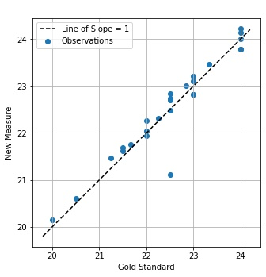
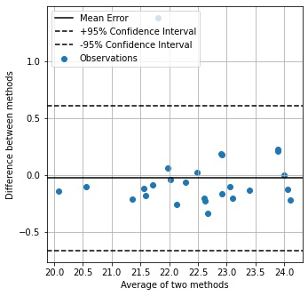

# BlandAltmanPy
Python package for performing statistical validation on the results of a regression model compared to the gold standard measurements.

Python script to perform Bland-Altman statistical analysis on two vectors of data. Create a BlandAltman class with your data and call methods to automatically generate Bland-Altman statistics and graphs. Statistics and graphs are based on the gold standard Bland-Altman style statistical comparison preseented in [[1]](https://pubmed.ncbi.nlm.nih.gov/2868172/) and [[2]](https://mail.biochemia-medica.com/assets/images/upload/xml_tif/Giavarina_Davide-Understanding_Bland_Altman_analyses.pdf).

The Bland-Altman method was introduced in a 1986 journal paper by those authors and presented methods for assessing validation of a new measure compared to a gold standard measure. These statistical methodologies have become the gold standard for comparing data from a novel medical device.

## Steps
1. Place the BlandAltman.py file in the folder you are working in
2. In Python call 'import BlandAltmanPy'
3. Get your two vectors of data into the Notebook
    - See example with example_data.csv file
      - One column should have the gold standard measurements
      - Another column should have the new measurements that you are comparing
      - Labels should be in first row
4. Create the BlandAltman class for your data:
```python
compare = BlandAltmanPy.BlandAltman(df.gold_standard,df.new_measure)
```
5. Now you can call methods off of compare to get statistics and plots

See the *Example_Jupyter_Notebook* file for an example of using BlandAltmanPy within Jupyter Notebooks.


## Details
### Statistics
Get BlandAltman statistics by entering:
```python
compare.print_stats()
```
|Statistic     |Description                 |
|--------------|----------------------------|
|Mean error    |The average of all the differences between the gold standard measure and the new measure|
|Mean absolute error |The average of all the absolute differences between the gold standard measure and the new measure|
|Mean squared error |The average of all the squared differences between the gold standard measure and the new measure. This metric does a better job than MAE at punishing outliers in the data, but has the disadvantage that the metric is no longer in the same units as the original inputs|
|Root mean squared error | The average of all the square root of the squared differences between the gold standard and the new measure. This metric is in the same units as the original inputs|
|Correlation |Pearson Product Correlation between the gold standard measure and the new measure|
|95% Confidence Intervals |Based on the provided data, there is a 95% chance that any new measure obtained falls within this range of the gold standard  measure|

Adjust number of decimals in *print_stats* output by setting *round_amount*:
```python
compare.print_stats(round_amount = 3)
```

Return a python dictionary of the statistics:
```python
stats_dict = compare.return_stats()
```


### Scatter Plot
Get the BlandAltman scatter plot by:
```python
compare.scatter_plot()
```


### Difference Plot
Get the BlandAltman difference plot by:
```python
compare.difference_plot()
```

- The legend location looks a bit odd in the above graph. This is because it is set to auto-adjust to any location that will not cover the data points.

## Advanced Settings
### Set custom labels for scatter plot
```python
compare.scatter_plot(x_label='ECG HR [bpm]',y_label='PPG HR [bpm]')
```
### Set title in plots
```python
compare.scatter_plot(x_label='ECG HR [bpm]',y_label='PPG HR [bpm]',the_title='HR Comparison')
compare.difference_plot(the_title='Bland-Altman Differnce Plot')
```

### Toggle legend off in plots
Turn legend off in plots by setting *show_legend=False*:
```python
compare.scatter_plot(x_label='ECG HR [bpm]',y_label='PPG HR [bpm]',the_title='HR Comparison',show_legend=False)
compare.difference_plot(the_title='Bland-Altman Differnce Plot',show_legend=False)
```

### Save plots as images
The default behaviour is to save each plot image to a .pdf file in the *output_images* folder. You can adjust the name and extension of the saved image by using the *file_name* setting:
```python
compare.scatter_plot(x_label='ECG HR [bpm]',y_label='PPG HR [bpm]',file_name='HR_Scatter_Compare.jpg')
compare.difference_plot(file_name='blood_pressure_diff_plot.pdf')
```


### Set figure size in plots
Set figure size in inches. Useful for formatting images to fit journal paper size requirements. Default is *figure_size=(4,4)*
```python
compare.scatter_plot(x_label='ECG HR [bpm]',y_label='PPG HR [bpm]',the_title='Heart Rate Comparison',figure_size=(8,8))
compare.difference_plot(the_title='Bland-Altman Differnce Plot',figure_size=(8,8))
```

### Adjust for multiple measurements on one subject
Each measurement must come from an independent sample. This means that if you have multiple observations from one subject they must be averaged together to make one observation. This affects how the 95% confidence intervals are calculated. Set *averaged* to True in the initial set up of the BlandAltman class:

```python
compare = BlandAltman(df.gold_standard,df.new_measure,averaged=True)
```

### Generating plots for journal papers
Avoid use of type 3 fonts for journal paper acceptance by setting the *is_journal* input to True:
```python
compare.scatter_plot(x_label='ECG HR [bpm]',y_label='PPG HR [bpm]',is_journal=True)
```
# References

[1] Bland, J.M. and Altman, D., 1986. Statistical methods for assessing
agreement between two methods of clinical measurement. The lancet,
327(8476), pp.307-310.

[2] Giavarina, D., 2015. Understanding bland altman analysis. Biochemia
medica: Biochemia medica, 25(2), pp.141-151.
